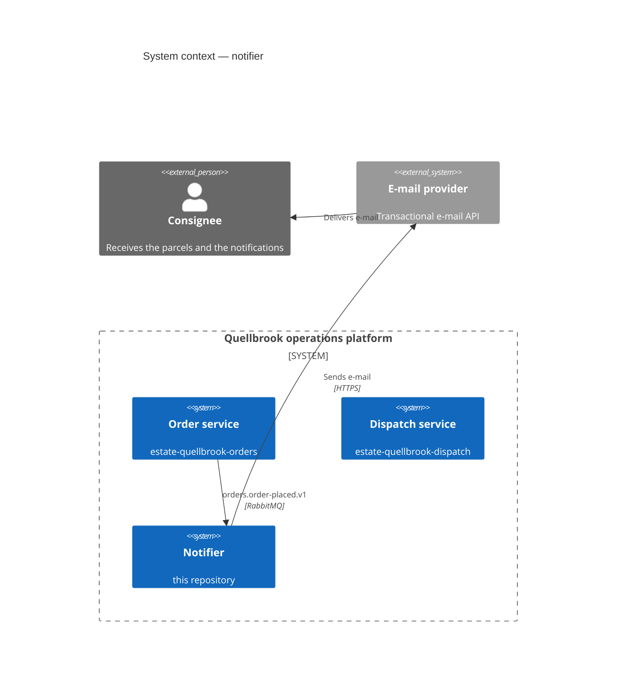
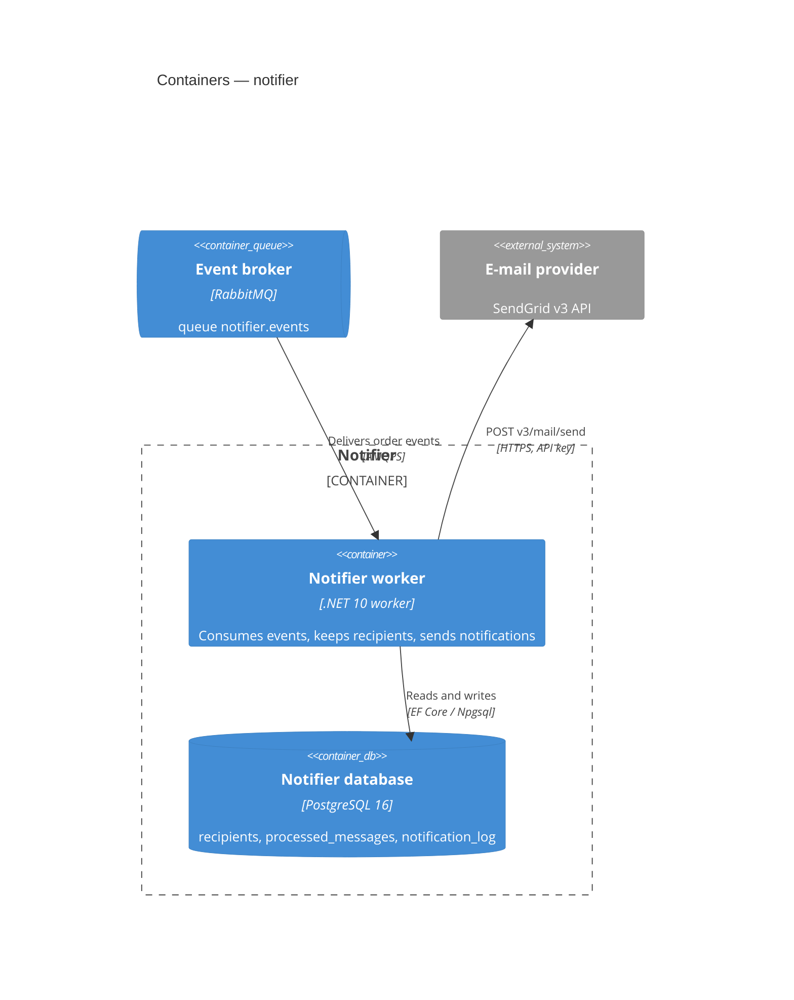

# Architecture — notifier

## Context

The notifier is one of five parts of the Quellbrook operations platform and the only one that talks to consignees.

## Containers

## Inside the worker

| Folder | Responsibility |
|---|---|
| `Messaging/` | the RabbitMQ consumer, the inbox, the notifier's copies of the consumed message types |
| `Notifications/` | the handlers per event, the notification service and log, templates, contact masking |
| `Channels/` | the provider clients behind `IEmailSender` (resilience: timeouts, retries, circuit breaker) |
| `Persistence/` | EF Core context and migrations |
| `Hosting/` | service registration, OpenTelemetry, the heartbeat the probes read |

The worker serves no HTTP. Kubernetes reads its health from a heartbeat file (`/tmp/heartbeat`) that is rewritten
after each health-check round.

## Message contracts

| Routing key | Fields the notifier reads | Producer |
|---|---|---|
| `orders.order-placed.v1` | order id, consignee name, contact e-mail and phone | order service |
